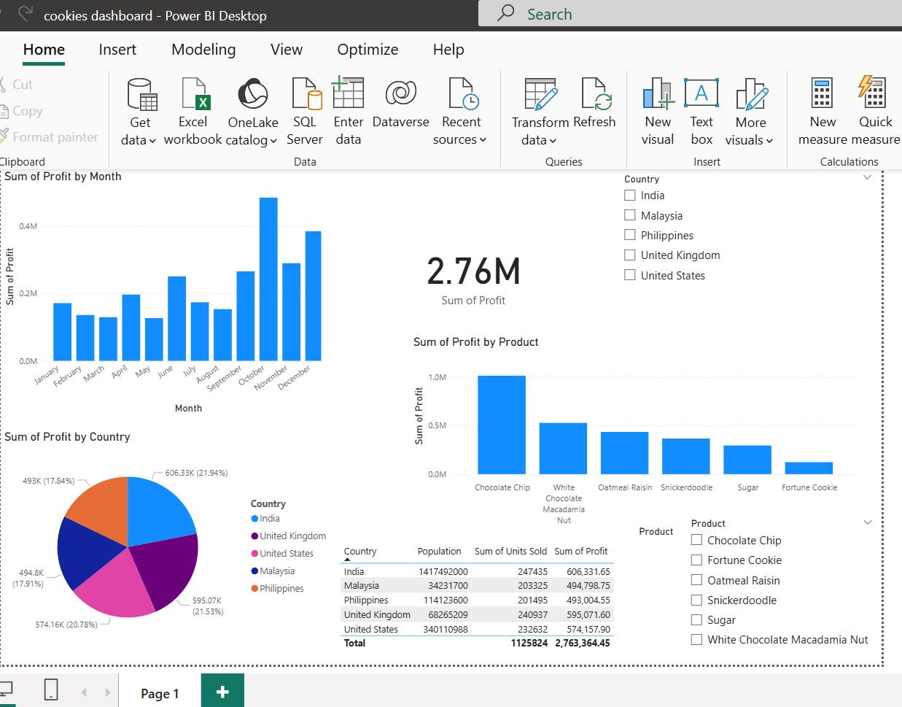

  🚀 Just wrapped up a Cookies Sales Dashboard in Power BI!
This project involved:
 ✅ Data Cleaning & Transformation – ensuring consistency and accuracy.
 ✅ Country-wise Analysis – breaking down performance by India, Malaysia, Philippines, UK, and USA.
 ✅ Profit Insights – highlighting which countries and products drive the most growth.
 ✅ Product-wise Breakdown – from Chocolate Chip 🍪 to Fortune Cookie 🥠, visualizing profitability across product categories.
📊 Key Insights:
 🔹 USA, UK, and India lead in overall profit contribution.
 🔹 Chocolate Chip remains the top-performing product.
 🔹 Country-wise patterns reveal different consumer preferences.
I really enjoyed bringing raw data to life through interactive visuals and meaningful insights. Power BI makes it possible to not just analyze data but also tell a story with it.
🔗 Check out the full project on GitHub:https://lnkd.in/dCx_wfWb 
 👉 Kevin Cookie Company Financial Analysis – Power BI  linkedin post 
hashtag#PowerBI hashtag#DataAnalytics hashtag#DataVisualization hashtag#BusinessIntelligence hashtag#DataDriven
